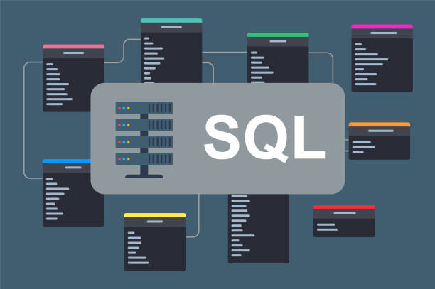

[](https://www.udemy.com/course/impariamo-sql-con-oracle-e-sqlserver/)


---
---
## INTRODUZIONE
---
Questa è la guida del [Corso di SQL](https://www.udemy.com/course/impariamo-sql-con-oracle-e-sqlserver/).
Gli argomenti della guida non sono in ordine con le lezioni del corso e trattano solo la parte SQL DEVELOPER inveche che i 3 diversi linguaggi a cui fa riferimento nelle lezioni poichè le differenze sono minime.
Spero che questa guida possa aiutare il vostro percorso.  
Buono Studio.  [^1]

[^1]: Se Trovate errori non fatevi problemi a contattarmi o mandare un messaggio in modo da rendere questa guida il più corretta possibile

  - [INTRODUZIONE](#introduzione)
  - [CREAZIONE DB](#creazione-db)
    - [PRINCIPI DI CREAZIONE DB](#principi-di-creazione-db)
    - [CREATE DATABASE](#create-database)
    - [Analisi delle Entità](#analisi-delle-entità)
    - [INDEX E SEQUENZE  NELLE TABELLE](#index-e-sequenze--nelle-tabelle)
    - [RELAZIONI TRA ENTITÀ](#relazioni-tra-entità)
    - [NORMALIZZAZIONE TRA TABELLE](#normalizzazione-tra-tabelle)
 
    - [SCHEMA ERD](#schema-erd)
  - [INSERIMENTO, MODIFICA E ELIMINAZIONE DATI](#inserimento-modifica-e-eliminazione-dati)
    - [Clonazione tabelle](#clonazione-tabelle)
    - [INSERT](#insert)
    - [UPDATE](#update)
    - [DELETE](#delete)
  - [COMANDI BASE SQL](#comandi-base-sql)
    - [*SELECT* E *FROM*](#select-e-from)
    - [WHERE](#where)
    - [ALIAS](#alias)
    - [ORDER BY](#order-by)
    - [FETCH FIRST ROWS](#fetch-first-rows)
  - [JOIN](#join)
    - [INNER JOIN](#inner-join)
    - [LEFT/RIGHT OUTER JOIN](#leftright-outer-join)
    - [FULL E CROSS JOIN](#full-e-cross-join)
    - [UNION MINUS E INTERSECT](#union-minus-e-intersect)
  - [SUBQUERY](#subquery)
    - [SUBQUERY semplici](#subquery-semplici)
    - [Parametro ALL e ANY](#parametro-all-e-any)
    - [SUBQUERY come Sostituti di Tabelle](#subquery-come-sostituti-di-tabelle)
    - [CTE (Common TAble Expression)](#cte-common-table-expression)
  - [FUNZIONI DI AGGREGAZIONE](#funzioni-di-aggregazione)
    - [GROUP BY](#group-by)
    - [HAVING](#having)
    - [ROLLUP e CUBE](#rollup-e-cube)
      - [ROLLUP](#rollup)
      - [CUBE](#cube)
  - [TIPI DI DATI](#tipi-di-dati)
  
  - [FUNZIONI](#funzioni)
    - [FUNZIONI DI CONVERSIONE](#funzioni-di-conversione)
    - [FUNZIONI DI MANIPOLAZIONE STRINGHE](#funzioni-di-manipolazione-stringhe)
    - [FUNZIONI MANIPOLAZIONE DEI NUMERI](#funzioni-manipolazione-dei-numeri)
    - [FUNZIONI MANIPOLAZIONE DATA E ORA](#funzioni-manipolazione-data-e-ora)
    - [FUNZIONI CASE NVL E NVL2](#funzioni-case-nvl-e-nvl2)
    - [FUNZIONE COALESCE](#funzione-coalesce)
    - [GROUPING](#grouping)
  - [FUNZIONI ANALITICHE](#funzioni-analitiche)
    - [FUNZIONI ANALITICHE](#funzioni-analitiche-1)
    - [PIVOT E UNPIVOT](#pivot-e-unpivot)
- [**"The key, the whole key, and nothing but the key, so help me Codd."**](#the-key-the-whole-key-and-nothing-but-the-key-so-help-me-codd)


## CREAZIONE DB 

---
---
### PRINCIPI DI CREAZIONE DB

Per creare un nuovo DB è necessario seguire delle linee guida ben precise per facilitare l'inserimento dati e poi successivamente le l'implementazione delle Query.

* Analisi e conoscenza delle informazioni che saranno archiviate nel DB

* Identificare gli elementi che DEVONO essere archiviati

* Dividere gli elementi complessi in unità piu piccole 

* Creare la struttura delle tabelle ( chiavi, colonne e F_K)

* Normalizzazione del DB e minimizzazione dei dati non necessari 

* Identificare indici per massimizzare l'efficienza delle Query

---

### CREATE DATABASE 

```sql
use master;

CREATE DATABASE db_Name;
```

Comando usato per creare un nuovo DB.

Sarà poi necessario andare ad impostare le propietà come memoria disponibile, aggiornamento dello spazio di memoria (incremento) e lo stesso dei log.

---

### Analisi delle Entità

Le Entità in SQL rappresentano gli "oggetti" del mondo reale trasportatiin formato di tabelle
Ogni colonna rappresenta gli attributi mentre ogni riga un'istanza di quell'entità.

Per definire un entità è necessario quindi creare una tabella specificnto attributi e le relative proprietà.

```sql
CREATE TABLE employees (
    employee_id INT NOT NULL ,
    first_name VARCHAR(50),
    last_name VARCHAR(50),
    email VARCHAR(100),
    hire_date DATE,
    department_id INT,
    ON DELETE CASCADE
);


```
È poi necessario stabilire quale sarà la  PRIMARY KEY della tabella, ovvero il campo che identificherà univocamente ogni record nella tabella DEVE ESSERE NOT NULLABLE 

Possiamo anche dare valori di DEFAULT ai campi di un entità nel caso che , durante l'insert, vengano lasciati vuoti o settati a *null*

Possiamo anche poi dare la proprietà UNIQUE a qualsiasi campo, ciò comporterà che l'inserzione nel db di un attributo duplicato risulerà in errore.

In questo caso aggiungiamo dopo la dichiarazione dei campi il comando :

 ```sql
COSTRAINT pk_employee_id_table1 PRIMARY KEY (EMPLOYEE_ID),

```
poi sarà necessario identificare quella che è chiamata la FOREIGN KEY  o FK che servirà a legare le entità di questa tabella con entità e attributi di altre tabelle , un ponte per collegarle, solitamente è la chiave che viene usata quando effettuiamo dei JOIN tra tabelle  

```sql
COSTRAINT department_FK_employees foreign key (department_id) reference department (department_id),

```
la sintassi si costruisce impostando il nome della FK e poi referenziando quale campo della tabella 1 si legherà alla tabella 2

```sql
CREATE TABLE Departments (
    department_id INT PRIMARY KEY,
    department_name VARCHAR(100),
    location VARCHAR(100)
);
```
Grazie alla FK potremmo quindi legare le informazioni di una qualsiasi entità employee a dipartimento a cui la'attributo department_id fa riferimento

ON DELETE CASCADE determina che , nel caso un elemento venga cancellato dalla tabella verrano cancellati anche tutti gli attributi legati dalla sua FK
Al contrario ON UPDATE CASCADE andrà ad aggiornare tutti gli attributi di una entità se verrà aggiornata e di conseguenza anche quelli non legati direttamente a quella tabella.

È possibile modificare tabelle già esistenti grazie al comando ALTER TABLE table_name

```sql

ALTER TABLE Employees
MODIFY email VARCHAR(255);

```

Ad esempio possiamo concatenarlo ai comandi ADD per aggiungere una colonna, DROP per eliminare una colonna o se necessario un COSTRAINT se vogliamo modificare una Primary key o FK.
possiamo anche usare il comando UPDATE per modificare il contenuto di una colonna ma SEMPRE usando il filtro where.

---

### INDEX E SEQUENZE  NELLE TABELLE

Gli indici consentono di eseguire ricerche più veloci all'interno di grandi volumi di dati. Senza un indice, il DBMS dovrebbe esaminare tutte le righe della tabella per trovare corrispondenze, mentre con un indice, può utilizzare una struttura di ricerca efficiente (come un albero B+ o un hash table) per individuare rapidamente le righe desiderate.

```sql
CREATE UNIQUE INDEX idx_email ON Employees(email);
```
Garantisce che tutti i valori in una colonna (o un insieme di colonne) siano univoci. Viene spesso utilizzato per implementare vincoli di unicità.

**LE SEQUENZE** 
Sono degli oggetti utilizzati oer generare valori numerici univoci in modo automatico e incrementale, spesso utilizzati per generare chiavi primarie basiche come ID. 
sono indipendenti dalle transazioni e grarantiscono la progressività della sequenza stessa.

```sql
CREATE SEQUENCE seq_employee_id
    START WITH 1
    INCREMENT BY 1
    ;
```
questa sequenza andrà a generare valori che partono da 1 ed incrementarli di 1 ogni volta, ad insert di un nuovo employee verrà assegnato un valore della sequenza che sappiamo essere univoco. infatti nell'INSERT non è necessario inserire dati nel campo id in quanto la sequenza lo riempirà da sola.

```sql
ALTER SEQUENCE seq_employee_id INCREMENT BY 2;
```
Possiamo ovviamente andare a modificare la sequenza utilizzando tuttii comandi che abbiamo già visto come anche DROP 
o visualizzarla con SELECT (resituirà il prossimo valore)


---

### RELAZIONI TRA ENTITÀ

Le relazioni tra entità in un database relazionale rappresentano le connessioni logiche o semantiche tra le diverse tabelle (entità) all'interno del database. 
Viene definito come le entità interagiscono tra loro.

* **Relazione Uno a Uno (1-1)**
Una 1-1 si verifica quando ognirecord di una tabella è associato ad esattamente un record in un altra tabella e viceversa

* **Relazione Uno a Molti (1-N)**
Ogni record di una tabella è associato a uno o più record di un'altra tabella MA adogni record in quest'ultima è associato uno e un solo record della tabella iniziale 

* **Relazione Molti a Molti (N-N)**
si verifica quando ogni record in una tabella può essere associato a molti record in un'altra tabella e vicversa.
Per questo tipo di relazione è necessario utilizzare una tabella ponte di collegamento tra le due tabelle coinvolte.

---

### NORMALIZZAZIONE TRA TABELLE 

la normalizzazione delle entità di un DB si riferisce a dei set di regole a cui tutte le entità sono sottoposte per garantire la minima ridondanza di dati puntando a organizzarli in modo da memorizzarli una volta sola e garantire quindi la massima efficienza delle Query
in particolare sono 3 regole o FORME 

* **PRIMA FORMA NORMALE**
Ogni colonna di una tabella debba contenere solo valori atomici e che ogni cella della tabella deve contenere un singolo valore, evitando valori multi-valore o ripetizioni.
* **SECONDA FORMA NORMALE**
Una tabella già in 1FN e ogni non-chiave sia completamente dipendente dalla chiave primaria. Ciò significa che ogni colonna che non fa parte della chiave primaria dovrebbe dipendere solo da tutta la chiave primaria, evitando dipendenze parziali.
* **TERZA FORMA NORMALE**
 tabella già in 2FN e che non ci siano dipendenze transitivi tra le colonne non-chiave. Ciò significa che le colonne non-chiave dovrebbero dipendere solo dalla chiave primaria e non da altre colonne non-chiave.

 Ecco un esempio :

Tabella NON Normalizzata 
| StudentID | StudentName | Course1 | Grade1 | Course2 | Grade2 | Course3 | Grade3 |
|-----------|-------------|---------|--------|---------|--------|---------|--------|
| 1         | John Doe    | Math    | A      | Science | B      | History | C      |
| 2         | Jane Smith  | Science | A      | English | B      | Math    | A      |

* Ogni riga rappresenta uno studente.
* I nomi dei corsi e i voti sono distribuiti in colonne multiple (Course1, Grade1, Course2, Grade2, ecc.).
* La tabella contiene molte ripetizioni di informazioni (ad esempio, nomi dei corsi e voti).
* La tabella viola i principi delle forme normali, in quanto non è organizzata in modo efficiente e contiene ridondanza dei dati.

Per portarla alla 1FN organizziamo i dati in modo che ogni cella contenga un singolo valore ATOMICO e che ogni riga sia identificata ua una Primary Key :

| StudentID | StudentName | Course  | Grade |
|-----------|-------------|---------|-------|
| 1         | John Doe    | Math    | A     |
| 1         | John Doe    | Science | B     |
| 1         | John Doe    | History | C     |
| 2         | Jane Smith  | Science | A     |
| 2         | Jane Smith  | English | B     |
| 2         | Jane Smith  | Math    | A     |
 
 Per passare alla 2FN dobbiamo eliminare le dipendenze parziali rispetto alla PK
 separando il tutto in piu tabelle :
 tabella Students

 | StudentID | StudentName |
|-----------|-------------|        
| 1         | John Doe    |
| 2         | Jane Smith  |
---
tabella Courses 
| CourseID | CourseName |
|----------|------------|
| 1        | Math       |
| 2        | Science    |
| 3        | History    |
| 4        | English    |
---
tabella Grades
| StudentID | CourseID | Grade |
|-----------|----------|-------|
| 1         | 1        | A     |
| 1         | 2        | B     |
| 1         | 3        | C     |
| 2         | 2        | A     |
| 2         | 4        | B     |
| 2         | 1        | A     |

Infine per trasformarla in 3FN dobbiamo eliminare le dipendenze transitive --> I valori NON chiave devono dipendere SOLO dalla chiave primaria diretta e non da valori NON chiave .
ovvero separare ulteriormete la tabella grades in 3 tabelle : 
tabella grades 
| StudentID | CourseID | Grade |
|-----------|----------|-------|
| 1         | 1        | A     |
| 1         | 2        | B     |
| 1         | 3        | C     |
| 2         | 2        | A     |
| 2         | 4        | B     |
| 2         | 1        | A     |
---
tabella CourseDetails 
| CourseID | DepartmentID |
|----------|--------------|
| 1        | 1            |
| 2        | 1            |
| 3        | 1            |
| 4        | 2            |
---
e tabella Department
| DepartmentID | DepartmentName |
|--------------|----------------|
| 1            | Science        |
| 2            | Arts           |

 in questa ultima forma possiamo notare che Sì il numero di tabelle è aumentato ma che ogni valore non chiave (i non ID) dipende solo da un valore chiave .
 
 ---
### SCHEMA ERD

Alla fine del processio di analisi delle entità di un db possiamo mettere in pratica tutte le modifiche che abbiamo fattoe e creare un ERD :
un diagramma Entity-Relationship (ERD) è uno strumento visuale utilizzato per rappresentare la struttura logica dei dati in un database. Questo tipo di diagramma mostra le entità (tabelle) nel database, insieme alle relazioni tra di esse. L'ERD aiuta a comprendere le associazioni tra le entità e a visualizzare la struttura dei dati in modo intuitivo.

**Componenti dell'ERD**:
* Entità: Tabelle con attributi 

* Attributi: Sono le proprietà o le caratteristiche di un'entità. Gli attributi sono rappresentati come colonne nelle tabelle del database.

* Relazioni: Definiscono le associazioni tra le entità e indicano come le entità sono correlate tra loro.


In questo grafico possiamo vedere anche le relazioni (1-N) tra le entità del DB oltre a vedere direttamente le Primary Key e le Foreign Key .

Attraverso l'ERD possiamo anche andare a creare tutto il nostro database grazie alla UI del nostro programma, un modo semplice per visualizzare collegamenti complessi nel CREATE TABLE.

---
---
## INSERIMENTO, MODIFICA E ELIMINAZIONE DATI 
---
---
### Clonazione tabelle
Possiamo Clonare tabelle per effettuare test oppure per creare dei set di dati piu piccoli.

```sql
CREATE TABLE table2 AS 
SELECT * FROM table1  
WHERE condizione
```
automaticamente la popolerà con i risultati della SubQ ma perderemo tutte le Primary-Key

---

### INSERT

comando per inserire dati nelle tabelle 

ci sono 3 alternative 
* senza specificare colonne 

```sql
INSERT INTO table1 
VALUES ('X','Y','Z');
```
in questo caso i dati verranno assegnati nell'ordine in cui compaiono le colonne nella tabella e nel caso alcune saranno settate a null.

* esplicitiamo le colonne

```sql
INSERT INTO table2 (column1,column2,column3)
VALUES('x','y','z')
```
quei valori verranno inseriti in quelle tabelle in quell'ordine preciso

* inserimento su tabelle multiple

```sql
INSERT ALL
    WHEN condition1 THEN INTO table1 (column1, column2) VALUES (value1, value2)
    WHEN condition2 THEN INTO table2 (column3, column4) VALUES (value3, value4)
    ELSE INTO default_table (column5, column6) VALUES (value5, value6)
SELECT column7, column8
FROM source_table;
```
ha bisogno di una DUMMY QUERY

Dopo l'INSERT è necessario dare la conferma del'inserimento con il comando COMMIT per rendere gli inserimenti permaneni nel DB.

---

### UPDATE 

Serve per modificare i dati già presenti nel DB 

```sql
UPDATE table1
SET
    column1 = MODIFICA
    column2 = MODIFICA
WHERE condizione / (SubQuery)    
```

È possibile modificare più campi contemporaneamente ed è anche possibile utilizzare una SubQuery come filtro della condizione 

---

### DELETE

serve per cancellare in maniera permanente (dopo il COMMIT )i dati dal DB 

```sql
DELETE FROM table1
WHERE condizione (solitamente confronto)
```
Come il caso dell UPDATE è possibile utilizzare una SubQuery come filtro.

---
---

## COMANDI BASE SQL  

###  *SELECT* E *FROM*

```SQL
SELECT   
```

Serve ad indicare le colonne che ci interessano da tabelle che ci interessano grazie al comando

``` SQL
FROM
```

Indica appunto le tabelle che vogliamo andare ad analizzare, modificare lavorare in generale.

 **Es.**

```SQL
    SELECT 
        <colonna1>
    FROM
        <tabella1>
```

---
**DISTINCT** -> specifica per il SELECT , indica che devono essere visualizzati solo dati provenienti da quella colonna che sono diversi l'uno dall'altro --> devono essere appunto distinti

```SQL
    SELECT DISTINCT 
        <colonna1>
    FROM 
        <tabella1>

```

---

### WHERE

Serve a filtrare dati dalla tabella che il from referenzia
utilizzato con:

- Confronto tra valore -> colonna1 = X (< , > , <> [diverso], <=, >=)

- Operatori logici -> X **AND** Y  (*OR*, *NOT* )

- Funzioni di Confronto -> colonna **BETWEEEN** X **AND** Y;
- Controllo su valori  ->  colonna **IN / NOT IN** ('nome1', 'nome2', etc)
- Filtro su modello di Stringa -> key word **LIKE** operatoti % e _

Il carattere % si riferisce ad un qualsiasi numero di carattere può essere usato sia all'inizio che alla fine di un pezzo di stringa

            WHERE colonna1 LIKE ('Ca%')

darà come true tutti le stringhe che iniziano per **Ca** : cane , casa , cavallo etc

_ si riferisce ad un singolo carattere che deve essere "riempito"

            WHERE colonna1 LIKE ('C__a')                    

in questo caso darà come risultato tutti i valori nel db che rispettano quelle condizioni ovvero che hanno al Primo posto una C e al quarto posto una A ad esempio casa , cava etc tutte da 4 caratteri

viene usato anche per cercare record che hanno nel nome un apostrofo che da noia al programma chiudendo gli apici nella parentesi

        WHERE acqua LIKE ('Sant_Anna')

esiste anche la condizione IS NULL E IS NOT NULL  serve a vedere se un dato campo ha come valore l'assenza del valore ovvero che ancora non è stato inserito (null);

**ES.**

```SQL
 SELECT 
    <colonna1>,
    <colonna2>
 FROM
    <tabella1>
 WHERE 
    <colonna1> = <valore>
    AND 
    <colonna2> >= <valore>

```

---

### ALIAS

A volte le Query iniziano a diventare complesse ed è difficile tenere traccia di quale campo appartiene a quale tabella, oppure per 'utente finale sarà complicato decifrare i titoli dei campi come REF_CP; per queste occasioni possiamo usare gli **ALIAS**

Parola chiave è AS da scrivere dopo la dichiarazione della colonna durante la SELECT

può essere seguita da una stringa singola oppure da una stringa compresa tra due apici "" se è complessa

è possibile concatenare diverse colonne in una sola usando i i simpoli || ' ' || tra i nomi delle colonne ( in questo caso ' ' significa spazio vuoto, avrei potuto mettere anche '-' trattino tra i due)

**ES**

```SQL
SELECT 
        <colonna1> AS "unità di misura",
        <colonna2> || '-' || <colonna3> AS  confronto

```

### ORDER BY

Serve a riordinare il risultato della Query in ordine secondo una colonna specifica

viene usato dopo il filtro della **WHERE**
 
```SQL
WHERE   
    <condizione>
GROUP BY 
    <colonna> DESC;    

```

Puo essere seguito dalle KEyword **DESC** per un ordine Decrescente o **ASC** per un ordine crescente.
Di base però l'ordine sarà crescente;

---

### FETCH FIRST ROWS

Limita il numero di Righe restitutite dalla Query
Vene usato dopo il **Order by**

```SQL
-- Seleziona le prime 10 righe dalla tabella products
SELECT product_id, product_name
FROM products
ORDER BY product_id
FETCH FIRST 10 ROWS ONLY;

```
Può essere usato insieme al comando **OFFSET** per far iniziare la restituzione della Query dalla riga del numero selezionato, può anche essere concatenato in questo modo:
```SQL
-- Seleziona la seconda pagina di 10 prodotti (record da 11 a 20)
SELECT product_id, product_name
FROM products
ORDER BY product_id
OFFSET 10 ROWS
FETCH FIRST 10 ROWS ONLY;

```

---
---

## JOIN

---
---


Le Join sono glis trumenti che permettono di lavorare con i dati condivisi tra due o più tabelle sfruttando le caratteristiche del DB per estrapolarne infomazioni

### INNER JOIN

La **INNER JOIN** combina le righe delle tabelle in base a una condizione di uguaglianza tra le colonne specificate.

È il Risultato di un'intersezione: restituisce solo le righe che hanno una corrispondenza in entrambe le tabelle coinvolte nella join.

```SQL
SELECT <column_list>
FROM table1
INNER JOIN table2 ON table1.column_name = table2.column_name;
```

Si usa appunto dopo *FROM*  e la condizione di uguaglianza ha la sintassi *Nometabella1*.colonna

Durante le Join è comune dare degli *ALIAS* alle tabelle per rendere piu leggibile il codice

```SQL
SELECT o.order_id, c.customer_name
FROM orders AS o
INNER JOIN customers c ON o.customer_id = c.customer_id;
```

La clausola *AS* è opzionale quando si definiscono gli alias delle tabelle. È possibile utilizzare semplicemente orders o e customers c per assegnare gli alias alle tabelle senza specificare esplicitamente *AS* .

---

È possibile avere INNER JOIN tra piu tabelle e persono tra piu colonne delle tabelle

```SQL
SELECT e.employee_id, e.first_name, e.last_name, d.department_name
FROM employees e
INNER JOIN departments d 
    ON e.department_id = d.department_id
INNER JOIN product p 
    ON p.product_place = d.department_name 
    AND p.team_id = e.team_id ;
```

Qua abbiamo nella Clausola **ON** la condizione *AND* che aggiunge un check su un ulteriore campo della tabella p a confronto in questo caso con un campo della tabella d.

Possiamo inoltre notare come tra le due JOIN le condizioni delle clausole ON referenzino sempre almeno una delle tabelle precedenti per "legare" il risultato.

Di Base SQL considera la keyword JOIN come INNER JOIN, non è quindi necessario specificarlo sempre 

---

### LEFT/RIGHT OUTER JOIN

**LEFT JOIN:**

Combina tutte le righe della tabella a sinistra (table1) con le righe corrispondenti della tabella a destra (table2), inclusi i record non corrispondenti nella tabella a destra (che avranno valori NULL per le colonne della tabella a destra).

```sql
SELECT *
FROM table1
LEFT JOIN table2 ON table1.column_name = table2.column_name;
```

**RIGHT JOIN:**

Combina tutte le righe della tabella a destra (table2) con le righe corrispondenti della tabella a sinistra (table1), inclusi i record non corrispondenti nella tabella a sinistra (che avranno valori NULL per le colonne della tabella a sinistra).

```sql
SELECT *
FROM 
    table1
RIGHT JOIN table2 ON 
    table1.column_name = table2.column_name;
```
---

È possibile combinare INNER E LEFT/RIGHT JOIN per estrarre ancora piu informazioni dai dati nel nostro DB 

Esempio di query con INNER JOIN e LEFT JOIN:

```sql
SELECT *
FROM table1
INNER JOIN table2
    ON table1.column1 = table2.column1
LEFT JOIN table3
    ON table1.column2 = table3.column2; 
```

In questa query:

Utilizziamo un INNER JOIN tra table1 e table2 sulla colonna1 per combinare le righe di entrambe le tabelle in base alla condizione di join specificata.
Successivamente, utilizziamo un LEFT JOIN tra il risultato del INNER JOIN precedente e table3 sulla colonna column2 per includere tutte le righe risultanti dal INNER JOIN e ottenere le corrispondenze da table3 se presenti.
In questo caso la condizione LEFT indica la INNER JOIN precedente e quindi le righe risultanti provenienti da quelle tabelle saranno nulle (null) se non è confermata la clausola ON.

---

### FULL E CROSS JOIN

 **FULL JOIN (o FULL OUTER JOIN)**:

Il **FULL JOIN** è un tipo di join che combina tutte le righe da entrambe le tabelle coinvolte, inclusi i risultati non corrispondenti da entrambe le tabelle. Ciò significa che tutte le righe dalla tabella di sinistra (prima nella clausola FULL JOIN) e dalla tabella di destra (seconda nella clausola FULL JOIN) verranno incluse nel risultato, anche se non ci sono corrispondenze tra di loro.

```sql
SELECT e.*, d.department_name
FROM employees e
FULL JOIN departments d ON e.department_id = d.department_id;
```

In questo esempio, il FULL JOIN restituirà tutte le colonne da employees e departments, inclusi i casi in cui non c'è corrispondenza tra department_id nelle due tabelle. Le righe che non hanno corrispondenze avranno valori NULL per le colonne della tabella opposta.

**CROSS JOIN:**

Il CROSS JOIN è un tipo di join che produce il prodotto cartesiano di due tabelle, ossia tutte le possibili combinazioni di righe tra le due tabelle, senza alcuna condizione di join specifica.

```sql
Copy code
SELECT e.*, d.department_name
FROM employees e
CROSS JOIN departments d;
```

il CROSS JOIN combina ogni riga della tabella employees con ogni riga della tabella departments, producendo un insieme di risultati in cui ogni impiegato è abbinato a ogni dipartimento. Il numero totale di righe nel risultato sarà il prodotto del numero di righe nelle due tabelle.

---

### UNION MINUS E INTERSECT

* **UNION**: Utilizzato per combinare i risultati di due query in un singolo insieme di risultati, eliminando duplicati.

```sql
SELECT column1, column2
FROM table1
UNION
SELECT column1, column2
FROM table2;
```

In questo esempio, UNION combina i risultati delle query selezionando le colonne 1 e 2 da table1 e table2, eliminando eventuali righe duplicate.

* **MINUS** (o EXCEPT in alcuni database): Utilizzato per ottenere le righe presenti nella prima query ma non nella seconda query.

```sql
SELECT column1, column2
FROM table1
MINUS
SELECT column1, column2
FROM table2;
```

In questo esempio, MINUS restituisce le righe selezionate dalla prima query (table1) che non sono presenti nella seconda query (table2), basandosi sulle colonne specificate.

* **INTERSECT**: Utilizzato per ottenere le righe presenti sia nella prima query che nella seconda query.

```sql
SELECT column1, column2
FROM table1
INTERSECT
SELECT column1, column2
FROM table2;
```

In questo esempio, INTERSECT restituisce le righe selezionate che sono comuni sia alla prima query (table1) che alla seconda query (table2), basandosi sulle colonne specificate.

Questi sono esempi di come UNION, MINUS (o EXCEPT) e INTERSECT possono essere utilizzati per combinare o confrontare i risultati di query diverse in SQL, consentendo di manipolare insiemi di dati in modi utili per l'analisi o la generazione di report.

---
---

## SUBQUERY 

---
---
### SUBQUERY semplici

Sono delle Query più semplici che vengono usate come filtro dalla Query principale.

Possono essere nel filtro **WHERE** con la clausola **IN**
e nel filtro **HAVING** come check di una funzione di aggregazione.

Vengono scritte come normali Query ma tra parentesi.


```sql
SELECT employee_name, salary
FROM employees
WHERE salary > (
    SELECT AVG(salary)
    FROM employees
);
```

oppure

```sql
SELECT customer_id, SUM(order_amount) AS total_amount
FROM orders
GROUP BY customer_id
HAVING SUM(order_amount) > (
    SELECT AVG(total_amount)
    FROM (
        SELECT customer_id, SUM(order_amount) AS total_amount
        FROM orders
        GROUP BY customer_id
    ) AS avg_amount
);
```
In questo caso la Subquery è un record di dati dove il filtro HAVING controlla il confronto.

---

### Parametro ALL e ANY

Il parametro **ALL** nelle subquery in SQL viene utilizzato per confrontare un valore con tutti i valori restituiti dalla subquery. Questa parola chiave è utilizzata con operatori di confronto come =, >, <, >=, <=, <> per confrontare il valore con ogni singolo valore risultante dalla subquery.

```sql
SELECT column1
FROM table1
WHERE column1 > ALL (SELECT column2 FROM table2 WHERE condition);
```
In questo esempio, la subquery restituisce un insieme di valori e il filtro **WHERE** confronta column1 con ogni valore restituito dalla subquery utilizzando il parametro  **ALL**. 
La condizione column1 > **ALL** sarà vera se e solo se column1 è maggiore di tutti i valori restituiti dalla subquer

Il parametro **ANY** ha la stessa sintassi di ALL ma sarà vero 
se ALMENO UNO dei valori soddifla la condizione dello WHERE

```sql
SELECT column1
FROM table1
WHERE column1 >= ANY (10, 20, 30);
```
Entrambi come si puo vedere sopra possono essere anche usati al di fuori delle SUBQUERY.

---

### SUBQUERY come Sostituti di Tabelle

Possiamo usare una SubQ come una tabella dalla quale la nostra QUery prncipale andrà a prendere i dati.
In questo caso solitamente diamo degli alias a queste SubQ per rendere più leggibile il codice (solitamwnte doppia lettera 'AA' etc)

Le usiamo quindi nella FROM della Query principale 

```sql
SELECT AA.customer_id, AA.total_amount
FROM (SELECT customer_id, SUM(order_amount) AS total_amount
      FROM orders
      GROUP BY customer_id) AS AA
WHERE total_amount > 1000;
```
---

### CTE (Common TAble Expression)

Un altro modo per usare le SubQuery è quello di dichiararle prima della SELECT tramite la parola chiave WITH  e usarle direttamente come se fossero tabelle del nostro DB 

```sql
WITH nome_cte (colonna1, colonna2, ...)
AS (
    SELECT colonna1, colonna2, ...
    FROM nome_tabella
    WHERE condizione
)
SELECT A.colonna1
FROM nome_cte A
WHERE condizione2;
```
---

## FUNZIONI DI AGGREGAZIONE

---
---
Sono funzioni utilizzate per calcolare un singolo valore risultante da un insieme di valori all'interno di un gruppo di righe. Queste funzioni sono ampiamente utilizzate nelle query per eseguire calcoli sui dati e ottenere risultati aggregati come somme, conteggi, medie, massimi e minimi.

SOno inserite nella Query nella **SELECT** come se fossero attributi di una tabella , infatti non sono altro che il risultato di una funzione su uno di questi campi .

In particolare sono:

* SUM()-> SOMMA
 La funzione SUM() restituisce la somma totale dei valori in una colonna numerica.

```sql
SELECT SUM(amount) AS total_sales
FROM orders;
```

* AVG()-> Media
La funzione AVG() calcola la media dei valori in una colonna numerica.

```sql
SELECT AVG(salary) AS average_salary
FROM employees;
```

* MIN()->Minimo
La funzione MIN() restituisce il valore minimo in una colonna.

```sql
SELECT MIN(salary) AS min_salary
FROM employees;
```

* MAX()-> Massimo
La funzione MAX() restituisce il valore massimo in una colonna.

```sql
SELECT MAX(amount) AS max_order_amount
FROM orders;
```

* COUNT (DISTINCT)->Conteggio
La funzione COUNT() restituisce il numero di righe o valori non nulli in una colonna.
Conta i valori unici non duplicati in una colonna specificata.

```sql
SELECT COUNT(customer_id) AS total_customers
FROM customers;
```

* COUNT (*)-> Conteggio
Conta il numero totale di righe nella tabella. Questa funzione viene spesso utilizzata per ottenere il conteggio complessivo delle righe, indipendentemente dalla presenza di valori NULL o duplicati.

```sql
SELECT COUNT(*) AS total_students
FROM students;
```

Solitamente seguiti da un alias come **AS** "Nome risultato" per rendere piu chiaro il risultato

---

### GROUP BY

Utilizzato per raggruppare le righe di una tabella in base ai valori di una o più colonne specifiche.

Raggruppa tutti i campi non Calcolati , ovvero quelli non derivati da una funzione di aggregazione è infatti necessario se abbiamo campi non calcolati.

```sql
SELECT 
    column1,colum2,
    aggregate_function(column3)
FROM table_name
GROUP BY column1, column2;
```
---

### HAVING

Operatore che applica un filtro ai campi calcolati soggetti a funzioni di aggregazione .

Il check sul filtro **Having** avviene dopo che tuti i campi sono stati calcolati a differenza del filtro **Where** che invece filtra quali dati devono essere poi calcolati.
Nella sintassi della Query è dichiarato dopo il **Group By**.

Puo essere usate anche dalle colonne senza funzioni di aggregazione.

```sql
SELECT column1, aggregate_function(column2)
FROM table_name
GROUP BY column1
HAVING condition;
```

---

### ROLLUP e CUBE 


#### ROLLUP 

Con la clausola ROLLUP nel group by vengono generati i totali tra le combinazioni delle colonne specificate.
Viene usato con funzioni di aggregazione per otterene risultati piu complessi. 

I totali sono seguono un ordine specifico e vengono creati basandosi sulla sequenza di colonne specificata nella clausola

```sql
SELECT year, month, SUM(revenue) AS total_revenue
FROM sales
GROUP BY ROLLUP(year, month)
ORDER BY year, month;
```
Risultato:

 |year|month|total_revenue|
 |---|---|---| 
 |2022|Jan|5000|
 |2022|Feb|6000|
 |2022|NULL|11000| 
 |2023|Jan|7000|
 |2023|Feb|8000|
 |2023|NULL|15000|
 |NULL|NULL|26000|

Possiamo vedere nella 3 riga abbiamo il vaolre totale dell'anno 2022 , nella 5 riga quello del 2023 e nell'ultima il valore combinato dei 2 anni.

È quindi la combinazione dei totali dei campi selezionati nella Query

#### CUBE

La clausola **CUBE** è utile quando si desidera ottenere una visione completa dei dati aggregati in quanto riporta tutte le possibili combinazioni dei dati specificati.
Si andranno solitamente a generare più righe rispetto al **ROLLUP** in quanto **CUBE** non segue un ordine specifico ma sono tutte le possibili proiezioni sui ragruppament di colonne.

```sql
SELECT year, month, SUM(revenue) AS total_revenue
FROM sales
GROUP BY CUBE(year, month)
ORDER BY year, month;
```
Risultato:

|year|month|total_revenue|
|---|---|---|
|2022|Jan| 5000|
|2022|Feb|6000|
|2022|NULL|11000|
|2023|Jan|7000|
|2023|Feb|8000|
|2023|NULL|15000|
|NULL|Jan|12000|
|NULL|Feb|14000|
|NULL|NULL|26000|

possiamo quindi notare i totali riportati che sono 
* totale anno 2022
* totale anno 2023 
* totale mesi Gennaio
* totale mesi Febraio
* totale di entrambe 

È quindi la combinazione delle righe specificate nella Query.

---
---
## TIPI DI DATI 

---
---

| Tipo di Dato     | Descrizione                                               |
|------------------|-----------------------------------------------------------|
| `CHAR(size)`     | Stringa di caratteri di lunghezza fissa                    |
| `VARCHAR2(size)` | Stringa di caratteri di lunghezza variabile               |
| `NCHAR(size)`    | Stringa di caratteri Unicode di lunghezza fissa            |
| `NVARCHAR2(size)`| Stringa di caratteri Unicode di lunghezza variabile        |
| `NUMBER(p, s)`   | Numero a virgola mobile con precisione fissa               |
| `FLOAT`          | Numero a virgola mobile con precisione doppia              |
| `BINARY_FLOAT`   | Numero a virgola mobile binario (precisione singola)       |
| `BINARY_DOUBLE`  | Numero a virgola mobile binario (precisione doppia)        |
| `DATE`           | Data e ora                                                 |
| `TIMESTAMP`      | Data e ora con precisione subsecondi                       |
| `CLOB`           | Oggetto di grandi dimensioni per testo carattere           |
| `BLOB`           | Oggetto di grandi dimensioni per dati binari               |
| `BFILE`          | File binario esterno                                        |
---
---

## FUNZIONI 

---
---

### FUNZIONI DI CONVERSIONE


| Funzione                    | Descrizione                                                            |
|-----------------------------|------------------------------------------------------------------------|
| `TO_CHAR(date, format)`     | Converte una data in una stringa di caratteri secondo il formato specificato |
| `TO_DATE(string, format)`   | Converte una stringa di caratteri in una data secondo il formato specificato |
| `TO_NUMBER(string)`         | Converte una stringa di caratteri in un numero                           |
| `TO_TIMESTAMP(string, format)` | Converte una stringa di caratteri in un timestamp secondo il formato specificato |
| `CAST(expression AS type)`  | Esegue il cast di un'espressione in un tipo di dato specificato          |

### FUNZIONI DI MANIPOLAZIONE STRINGHE

| Funzione                    | Descrizione                                                            |
|-----------------------------|------------------------------------------------------------------------|
| `SUBSTR(string, start, length)`   | Estrae una sottostringa da una stringa in base a una posizione di partenza e lunghezza specificata |
| `INSTR(string, substring)`       | Restituisce la posizione della prima occorrenza di una sottostringa all'interno di una stringa |
| `CONCAT(string1, string2)`       | Concatena due stringhe                                                 |
| `LOWER(string)`                  | Converte una stringa in caratteri minuscoli                             |
| `UPPER(string)`                  | Converte una stringa in caratteri maiuscoli                             |
| `INITCAP(string)`                | Converte la prima lettera di ogni parola in maiuscolo e le altre in minuscolo |
| `LENGTH(string)`                 | Restituisce la lunghezza di una stringa                                 |
| `TRIM(string)`                   | Rimuove gli spazi vuoti in eccesso da una stringa                       |
| `LTRIM(string)`                  | Rimuove gli spazi vuoti in eccesso dall'inizio di una stringa           |
| `RTRIM(string)`                  | Rimuove gli spazi vuoti in eccesso dalla fine di una stringa            |
| `REPLACE(string, search, replace)`| Sostituisce tutte le occorrenze di una sottostringa con un'altra in una stringa |
| `LPAD(string, length, pad_string)`| Aggiunge caratteri di riempimento alla sinistra di una stringa fino a raggiungere una determinata lunghezza |
| `RPAD(string, length, pad_string)`| Aggiunge caratteri di riempimento alla destra di una stringa fino a raggiungere una determinata lunghezza |


### FUNZIONI MANIPOLAZIONE DEI NUMERI

| Funzione                    | Descrizione                                                            |
|-----------------------------|------------------------------------------------------------------------|
| `ROUND(n, p)`  | Arrotonda un numero alla precisione specificata                        |
| `TRUNC(n,p)`  | Tronca un numero alla precisione specificata (rimuove le cifre decimali) |
| `CEIL(n)`              | Arrotonda un numero verso l'alto al valore intero più vicino           |
| `FLOOR(n)`             | Arrotonda un numero verso il basso al valore intero più vicino         |
| `ABS(n)`               | Restituisce il valore assoluto di un numero                             |
| `MOD(dividendo, divisore)`    | Restituisce il resto di una divisione (modulo) tra due numeri          |
| `POWER(base, esponente)`      | Calcola la potenza di un numero (base) elevato a un esponente           |
| `SQRT(n)`              | Calcola la radice quadrata di un numero                                |
| `SIGN(n)`              | Restituisce il segno di un numero (-1 se negativo, 0 se zero, +1 se positivo) |
| `GREATEST(n1, n2)` | Restituisce il numero più grande tra due numeri                        |
| `LEAST(n1, n2)`    | Restituisce il numero più piccolo tra due numeri                       |


### FUNZIONI MANIPOLAZIONE DATA E ORA 

| Funzione                           | Descrizione                                                            |
|------------------------------------|------------------------------------------------------------------------|
| `SYSDATE`                          | Restituisce la data e l'ora correnti nel formato di data e ora del database |
| `CURRENT_DATE`                     | Restituisce la data corrente nel formato di data del database         |
| `CURRENT_TIMESTAMP`                | Restituisce la data e l'ora correnti nel formato di timestamp del database |
| `TO_CHAR(date, format)`             | Converte una data in una stringa di caratteri secondo il formato specificato |
| `TO_DATE(string, format)`           | Converte una stringa di caratteri in una data secondo il formato specificato |
| `ADD_MONTHS(date, n)`               | Aggiunge un numero di mesi a una data                                  |
| `MONTHS_BETWEEN(date1, date2)`      | Calcola il numero di mesi tra due date                                 |
| `EXTRACT(unit FROM date)`           | Estrae una parte specifica (anno, mese, giorno, ora, minuto, secondo, etc.) da una data |
| `LAST_DAY(date)`                    | Restituisce l'ultimo giorno del mese di una data                       |
| `NEXT_DAY(date, day_of_week)`       | Restituisce la prossima data di una determinata settimana (es. 'MONDAY') dopo una data specificata |
| `ROUND(date [, format])`            | Arrotonda una data alla precisione specificata                         |
| `TRUNC(date [, format])`            | Tronca una data alla precisione specificata (rimuove ore, minuti, secondi) |

### FUNZIONI CASE NVL E NVL2 

* La funzione **CASE** è utilizzata per valutazioni su condizioni e restituire un valore al posto di un altro 

È eseguito nella sintassi seguente

```sql
CASE
    WHEN condition1 THEN result1
    WHEN condition2 THEN result2
    ...
    ELSE default_result
END
```
e come vediamo è seguito da THEN e alla fine END per chiudere la clausola.

* NVL e NVL2

servono per fare un check sui valori di una colonna e gestire i valori *(null)*
sostituendoli con valori alternativi in base alla presenza o meno di esso.

```sql
NVL(column, default_value)

```

```sql
NVL2(column, valore1, valore2)
```
NVL2 viene usato per sostituire il valore1 se  trova *non-null* e valore2 se invece trova *null* nei check sulla colonna.

### FUNZIONE COALESCE 

Serve per restituire il primo valore non nulla da una lista di valori (come può essere una colonna)

```sql
COALESCE (v1,v2,v3,...vN)
```
 oppure può essere usato per cambiare il valore null all'interno di una colonna con un valore che specifichiamo noi
 può essere utile per effettuar eoperazioni matematiche nel casoa vessimo valori che null.able

 ```sql
COALESCE(column,0)
```
### GROUPING 

Viene usato insieme al CASE WHEN THEN END 
è spesso utilizzato quando abbiamo a che fare con l'operatore **ROLLUP** e permette di cambiare i valori nulli risultati dal group by con quello che vogliamo per "pienare" quel campo.

```sql
CASE GROUPING (column) =1 THEN 'Valore Totale' ELSE etc etc 
```
___
___
## FUNZIONI ANALITICHE 
---
---

### FUNZIONI ANALITICHE

Le funzioni analitiche in SQL sono un insieme di funzioni avanzate che consentono di eseguire calcoli complessi su dati raggruppati senza dover utilizzare sottoquery o operazioni di join complesse. 

| Funzione       | Descrizione                                                                              | Sintassi                                                                                                                             |
|----------------|------------------------------------------------------------------------------------------|--------------------------------------------------------------------------------------------------------------------------------------|
| SUM() OVER()   | Calcola la somma di una colonna su una partizione di righe.                               | ``` SELECT colonna1, colonna2, SUM(colonna3) OVER (PARTITION BY colonna1) AS total FROM tabella; ```                            |
| ROW_NUMBER()   | Assegna un numero di riga unico a ciascuna riga in una partizione, in base all'ordine.   | ``` SELECT colonna1, colonna2, ROW_NUMBER() OVER (ORDER BY colonna1) AS row_num FROM tabella; ```                               |
| RANK()         | Assegna un rango alle righe in base al valore ordinato.                                    | ``` SELECT colonna1, colonna2, RANK() OVER (ORDER BY colonna3 DESC) AS rank FROM tabella; ```                                    |
| LEAD()         | Restituisce il valore di una colonna dalla riga successiva all'interno di una partizione. | ``` SELECT colonna1, colonna2, LEAD(colonna3) OVER (ORDER BY colonna1) AS next_value FROM tabella; ```                         |
| LAG()          | Restituisce il valore di una colonna dalla riga precedente all'interno di una partizione. | ``` SELECT colonna1, colonna2, LAG(colonna3) OVER (ORDER BY colonna1) AS prev_value FROM tabella; ```                         |
| FIRST_VALUE()  | Restituisce il primo valore in base all'ordine specificato all'interno di una partizione. | ``` SELECT colonna1, colonna2, FIRST_VALUE(colonna3) OVER (PARTITION BY colonna1 ORDER BY colonna3) AS first_value FROM tabella; ``` |
| LAST_VALUE()   | Restituisce l'ultimo valore in base all'ordine specificato all'interno di una partizione. | ``` SELECT colonna1, colonna2, LAST_VALUE(colonna3) OVER (PARTITION BY colonna1 ORDER BY colonna3) AS last_value FROM tabella; ```  |
| LISTAGG()        | Concatena i valori di una colonna in una stringa, separati da un delimitatore specificato.     | ```sql SELECT colonna1, LISTAGG(colonna2, ', ') WITHIN GROUP (ORDER BY colonna2) AS concatenated_values FROM tabella GROUP BY colonna1; ``` |
| RATIO_TO_REPORT()| Calcola la percentuale di una riga rispetto alla somma totale in una partizione di righe.    | ```sql SELECT colonna1, colonna2, RATIO_TO_REPORT(colonna2) OVER (PARTITION BY colonna1) AS ratio FROM tabella; ```                           |
| CUME_DIST()      | Calcola la distribuzione cumulativa dei valori in un insieme di dati ordinato.                  | ```sql SELECT colonna1, colonna2, CUME_DIST() OVER (ORDER BY colonna2) AS cumulative_distribution FROM tabella; ``` |
| PERCENT_RANK()   | Calcola il rango percentuale di ciascun valore in un insieme di dati ordinato.                   | ```sql SELECT colonna1, colonna2, PERCENT_RANK() OVER (ORDER BY colonna2 DESC) AS percent_rank FROM tabella; ```   |


* **La WINDOW clause**
Chiamato così il blocco di codice all'interno delle parentesi dopo OVER che permette di alle funzioni analitiche di operare sui date che vogliamo, può essere configurata con una clausola PARTITION BY per dividere il set di dati in gruppi o con una clausola ORDER BY ( anche insieme al PARTITION) per irordinare i idati all'interno di una Partition.

---

### PIVOT E UNPIVOT 

* **PIVOT**: La clausola PIVOT consente di trasformare i dati da righe a colonne, aggregando i valori di una colonna specifica in nuove colonne corrispondenti a valori univoci di un'altra colonna.
Esempio :
da questa tabella 

| Seller    | Month | Sales  |
|--------|--------|--------|
| Alice     | Jan   | 1000   |
| Bob       | Jan   | 1500   |
| Alice     | Feb   | 1200   |
| Bob       | Feb   | 1800   |


grazie a PIVOT 

```sql
SELECT *
FROM (
    SELECT Seller, Month, Sales
    FROM Sales
)
PIVOT (
    SUM(Sales) FOR Month IN ('Jan', 'Feb')
) AS PivotTable;

```
abbiamo come risultato una tabella con le vendite di ogni vendirore per i mesi di gennaio e febbraio come colonne separate


| Seller | Jan    | Feb    |
|--------|--------|--------|
| Alice  | 1000   | 1200   |
| Bob    | 1500   | 1800   |


È come se fosse una rotazione (PIVOT) della tabella.

* **UNPIVOT**: L'operazione UNPIVOT consente di trasformare i dati da colonne a righe, convertendo valori di diverse colonne in una singola colonna con valori corrispondenti.
Esempio:
Dalla tabella di prima lanciando il comando UNPIVOT: 
```sql
SELECT Seller, Month, Sales
FROM (
    SELECT Seller, Jan, Feb
    FROM SalesSummary
) AS SalesSummaryUnpivot
UNPIVOT (
    Sales FOR Month IN (Jan, Feb)
) AS UnpivotTable;

```
torniamo piu o meno alla situazione di partenza :

| Seller | Month | Sales  |
|--------|--------|--------|
| Alice  | Jan   | 1000   |
| Alice  | Feb   | 1200   |
| Bob    | Jan   | 1500   |
| Bob    | Feb   | 1800   |

----
----

 # **"The key, the whole key, and nothing but the key, so help me Codd."**

---
---


