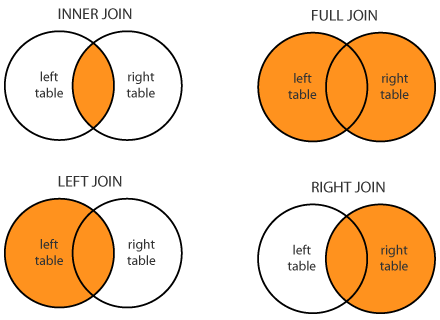

# JOIN

---
---



Le Join sono glis trumenti che permettono di lavorare con i dati condivisi tra due o più tabelle sfruttando le caratteristiche del DB per estrapolarne infomazioni

## INNER JOIN

La **INNER JOIN** combina le righe delle tabelle in base a una condizione di uguaglianza tra le colonne specificate.

È il Risultato di un'intersezione: restituisce solo le righe che hanno una corrispondenza in entrambe le tabelle coinvolte nella join.

```SQL
SELECT <column_list>
FROM table1
INNER JOIN table2 ON table1.column_name = table2.column_name;
```

Si usa appunto dopo *FROM*  e la condizione di uguaglianza ha la sintassi *Nometabella1*.colonna

Durante le Join è comune dare degli *ALIAS* alle tabelle per rendere piu leggibile il codice

```SQL
SELECT o.order_id, c.customer_name
FROM orders AS o
INNER JOIN customers c ON o.customer_id = c.customer_id;
```

La clausola *AS* è opzionale quando si definiscono gli alias delle tabelle. È possibile utilizzare semplicemente orders o e customers c per assegnare gli alias alle tabelle senza specificare esplicitamente *AS* .

---

È possibile avere INNER JOIN tra piu tabelle e persono tra piu colonne delle tabelle

```SQL
SELECT e.employee_id, e.first_name, e.last_name, d.department_name
FROM employees e
INNER JOIN departments d 
    ON e.department_id = d.department_id
INNER JOIN product p 
    ON p.product_place = d.department_name 
    AND p.team_id = e.team_id ;
```

Qua abbiamo nella Clausola **ON** la condizione *AND* che aggiunge un check su un ulteriore campo della tabella p a confronto in questo caso con un campo della tabella d.

Possiamo inoltre notare come tra le due JOIN le condizioni delle clausole ON referenzino sempre almeno una delle tabelle precedenti per "legare" il risultato.

Di Base SQL considera la keyword JOIN come INNER JOIN, non è quindi necessario specificarlo sempre 

---

## LEFT|RIGHT OUTER JOIN

**LEFT JOIN:**

Combina tutte le righe della tabella a sinistra (table1) con le righe corrispondenti della tabella a destra (table2), inclusi i record non corrispondenti nella tabella a destra (che avranno valori NULL per le colonne della tabella a destra).

```sql
SELECT *
FROM table1
LEFT JOIN table2 ON table1.column_name = table2.column_name;
```

**RIGHT JOIN:**

Combina tutte le righe della tabella a destra (table2) con le righe corrispondenti della tabella a sinistra (table1), inclusi i record non corrispondenti nella tabella a sinistra (che avranno valori NULL per le colonne della tabella a sinistra).

```sql
SELECT *
FROM 
    table1
RIGHT JOIN table2 ON 
    table1.column_name = table2.column_name;
```
---

È possibile combinare INNER E LEFT/RIGHT JOIN per estrarre ancora piu informazioni dai dati nel nostro DB 

Esempio di query con INNER JOIN e LEFT JOIN:

```sql
SELECT *
FROM table1
INNER JOIN table2
    ON table1.column1 = table2.column1
LEFT JOIN table3
    ON table1.column2 = table3.column2; 
```

In questa query:

Utilizziamo un INNER JOIN tra table1 e table2 sulla colonna1 per combinare le righe di entrambe le tabelle in base alla condizione di join specificata.
Successivamente, utilizziamo un LEFT JOIN tra il risultato del INNER JOIN precedente e table3 sulla colonna column2 per includere tutte le righe risultanti dal INNER JOIN e ottenere le corrispondenze da table3 se presenti.
In questo caso la condizione LEFT indica la INNER JOIN precedente e quindi le righe risultanti provenienti da quelle tabelle saranno nulle (null) se non è confermata la clausola ON.

---

## FULL E CROSS JOIN

 **FULL JOIN (o FULL OUTER JOIN)**:

Il **FULL JOIN** è un tipo di join che combina tutte le righe da entrambe le tabelle coinvolte, inclusi i risultati non corrispondenti da entrambe le tabelle. Ciò significa che tutte le righe dalla tabella di sinistra (prima nella clausola FULL JOIN) e dalla tabella di destra (seconda nella clausola FULL JOIN) verranno incluse nel risultato, anche se non ci sono corrispondenze tra di loro.

```sql
SELECT e.*, d.department_name
FROM employees e
FULL JOIN departments d ON e.department_id = d.department_id;
```

In questo esempio, il FULL JOIN restituirà tutte le colonne da employees e departments, inclusi i casi in cui non c'è corrispondenza tra department_id nelle due tabelle. Le righe che non hanno corrispondenze avranno valori NULL per le colonne della tabella opposta.

**CROSS JOIN:**

Il CROSS JOIN è un tipo di join che produce il prodotto cartesiano di due tabelle, ossia tutte le possibili combinazioni di righe tra le due tabelle, senza alcuna condizione di join specifica.

```sql
Copy code
SELECT e.*, d.department_name
FROM employees e
CROSS JOIN departments d;
```

il CROSS JOIN combina ogni riga della tabella employees con ogni riga della tabella departments, producendo un insieme di risultati in cui ogni impiegato è abbinato a ogni dipartimento. Il numero totale di righe nel risultato sarà il prodotto del numero di righe nelle due tabelle.

---

### UNION MINUS E INTERSECT

* **UNION**: Utilizzato per combinare i risultati di due query in un singolo insieme di risultati, eliminando duplicati.

```sql
SELECT column1, column2
FROM table1
UNION
SELECT column1, column2
FROM table2;
```

In questo esempio, UNION combina i risultati delle query selezionando le colonne 1 e 2 da table1 e table2, eliminando eventuali righe duplicate.

* **MINUS** (o EXCEPT in alcuni database): Utilizzato per ottenere le righe presenti nella prima query ma non nella seconda query.

```sql
SELECT column1, column2
FROM table1
MINUS
SELECT column1, column2
FROM table2;
```

In questo esempio, MINUS restituisce le righe selezionate dalla prima query (table1) che non sono presenti nella seconda query (table2), basandosi sulle colonne specificate.

* **INTERSECT**: Utilizzato per ottenere le righe presenti sia nella prima query che nella seconda query.

```sql
SELECT column1, column2
FROM table1
INTERSECT
SELECT column1, column2
FROM table2;
```

In questo esempio, INTERSECT restituisce le righe selezionate che sono comuni sia alla prima query (table1) che alla seconda query (table2), basandosi sulle colonne specificate.

Questi sono esempi di come UNION, MINUS (o EXCEPT) e INTERSECT possono essere utilizzati per combinare o confrontare i risultati di query diverse in SQL, consentendo di manipolare insiemi di dati in modi utili per l'analisi o la generazione di report.

---
---


