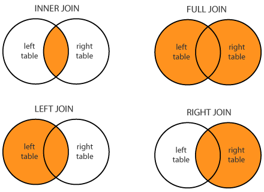

# JOIN

---
---



Le Join sono glis trumenti che permettono di lavorare con i dati condivisi tra due o più tabelle sfruttando le caratteristiche del DB per estrapolarne infomazioni

## INNER JOIN

La **INNER JOIN** combina le righe delle tabelle in base a una condizione di uguaglianza tra le colonne specificate.

È il Risultato di un'intersezione: restituisce solo le righe che hanno una corrispondenza in entrambe le tabelle coinvolte nella join.

```SQL
SELECT <column_list>
FROM table1
INNER JOIN table2 ON table1.column_name = table2.column_name;
```

Si usa appunto dopo *FROM*  e la condizione di uguaglianza ha la sintassi *Nometabella1*.colonna

Durante le Join è comune dare degli *ALIAS* alle tabelle per rendere piu leggibile il codice

```SQL
SELECT o.order_id, c.customer_name
FROM orders AS o
INNER JOIN customers c ON o.customer_id = c.customer_id;
```

La clausola *AS* è opzionale quando si definiscono gli alias delle tabelle. È possibile utilizzare semplicemente orders o e customers c per assegnare gli alias alle tabelle senza specificare esplicitamente *AS* .

---

È possibile avere INNER JOIN tra piu tabelle e persono tra piu colonne delle tabelle

```SQL
SELECT e.employee_id, e.first_name, e.last_name, d.department_name
FROM employees e
INNER JOIN departments d 
    ON e.department_id = d.department_id
INNER JOIN product p 
    ON p.product_place = d.department_name 
    AND p.team_id = e.team_id ;
```

Qua abbiamo nella Clausola **ON** la condizione *AND* che aggiunge un check su un ulteriore campo della tabella p a confronto in questo caso con un campo della tabella d.

Possiamo inoltre notare come tra le due JOIN le condizioni delle clausole ON referenzino sempre almeno una delle tabelle precedenti per "legare" il risultato.

Di Base SQL considera la keyword JOIN come INNER JOIN, non è quindi necessario specificarlo sempre 

---

## LEFT|RIGHT OUTER JOIN

**LEFT JOIN:**

Combina tutte le righe della tabella a sinistra (table1) con le righe corrispondenti della tabella a destra (table2), inclusi i record non corrispondenti nella tabella a destra (che avranno valori NULL per le colonne della tabella a destra).

```sql
SELECT *
FROM table1
LEFT JOIN table2 ON table1.column_name = table2.column_name;
```

**RIGHT JOIN:**

Combina tutte le righe della tabella a destra (table2) con le righe corrispondenti della tabella a sinistra (table1), inclusi i record non corrispondenti nella tabella a sinistra (che avranno valori NULL per le colonne della tabella a sinistra).

```sql
SELECT *
FROM 
    table1
RIGHT JOIN table2 ON 
    table1.column_name = table2.column_name;
```
---

È possibile combinare INNER E LEFT/RIGHT JOIN per estrarre ancora piu informazioni dai dati nel nostro DB 

Esempio di query con INNER JOIN e LEFT JOIN:

```sql
SELECT *
FROM table1
INNER JOIN table2
    ON table1.column1 = table2.column1
LEFT JOIN table3
    ON table1.column2 = table3.column2; 
```

In questa query:

Utilizziamo un INNER JOIN tra table1 e table2 sulla colonna1 per combinare le righe di entrambe le tabelle in base alla condizione di join specificata.
Successivamente, utilizziamo un LEFT JOIN tra il risultato del INNER JOIN precedente e table3 sulla colonna column2 per includere tutte le righe risultanti dal INNER JOIN e ottenere le corrispondenze da table3 se presenti.
In questo caso la condizione LEFT indica la INNER JOIN precedente e quindi le righe risultanti provenienti da quelle tabelle saranno nulle (null) se non è confermata la clausola ON.

