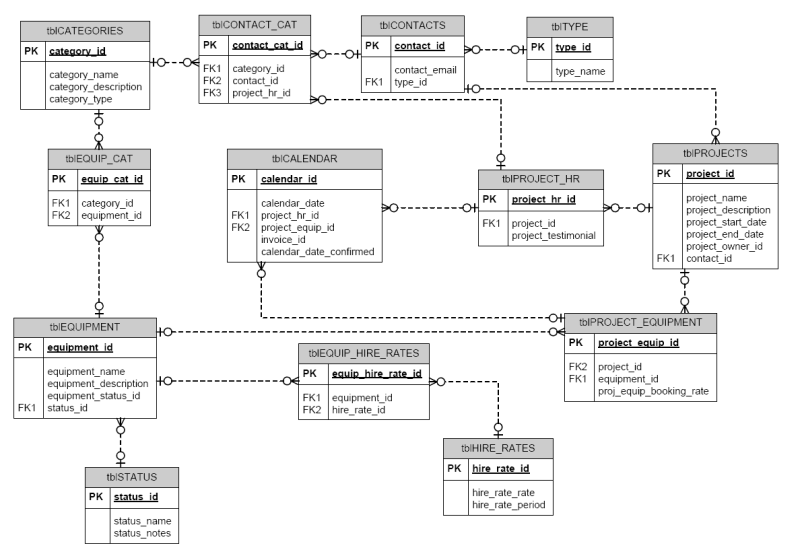

# CREAZIONE DB 

---
---
## PRINCIPI DI CREAZIONE DB

Per creare un nuovo DB è necessario seguire delle linee guida ben precise per facilitare l'inserimento dati e poi successivamente le l'implementazione delle Query.

* Analisi e conoscenza delle informazioni che saranno archiviate nel DB

* Identificare gli elementi che DEVONO essere archiviati

* Dividere gli elementi complessi in unità piu piccole 

* Creare la struttura delle tabelle ( chiavi, colonne e F_K)

* Normalizzazione del DB e minimizzazione dei dati non necessari 

* Identificare indici per massimizzare l'efficienza delle Query

---

## CREATE DATABASE 

```sql
use master;

CREATE DATABASE db_Name;
```

Comando usato per creare un nuovo DB.

Sarà poi necessario andare ad impostare le propietà come memoria disponibile, aggiornamento dello spazio di memoria (incremento) e lo stesso dei log.

---

## Analisi delle Entità

Le Entità in SQL rappresentano gli "oggetti" del mondo reale trasportatiin formato di tabelle
Ogni colonna rappresenta gli attributi mentre ogni riga un'istanza di quell'entità.

Per definire un entità è necessario quindi creare una tabella specificnto attributi e le relative proprietà.

```sql
CREATE TABLE employees (
    employee_id INT NOT NULL ,
    first_name VARCHAR(50),
    last_name VARCHAR(50),
    email VARCHAR(100),
    hire_date DATE,
    department_id INT,
    ON DELETE CASCADE
);


```
È poi necessario stabilire quale sarà la  PRIMARY KEY della tabella, ovvero il campo che identificherà univocamente ogni record nella tabella DEVE ESSERE NOT NULLABLE 

Possiamo anche dare valori di DEFAULT ai campi di un entità nel caso che , durante l'insert, vengano lasciati vuoti o settati a *null*

Possiamo anche poi dare la proprietà UNIQUE a qualsiasi campo, ciò comporterà che l'inserzione nel db di un attributo duplicato risulerà in errore.

In questo caso aggiungiamo dopo la dichiarazione dei campi il comando :

 ```sql
COSTRAINT pk_employee_id_table1 PRIMARY KEY (EMPLOYEE_ID),

```
poi sarà necessario identificare quella che è chiamata la FOREIGN KEY  o FK che servirà a legare le entità di questa tabella con entità e attributi di altre tabelle , un ponte per collegarle, solitamente è la chiave che viene usata quando effettuiamo dei JOIN tra tabelle  

```sql
COSTRAINT department_FK_employees foreign key (department_id) reference department (department_id),

```
la sintassi si costruisce impostando il nome della FK e poi referenziando quale campo della tabella 1 si legherà alla tabella 2

```sql
CREATE TABLE Departments (
    department_id INT PRIMARY KEY,
    department_name VARCHAR(100),
    location VARCHAR(100)
);
```
Grazie alla FK potremmo quindi legare le informazioni di una qualsiasi entità employee a dipartimento a cui la'attributo department_id fa riferimento

ON DELETE CASCADE determina che , nel caso un elemento venga cancellato dalla tabella verrano cancellati anche tutti gli attributi legati dalla sua FK
Al contrario ON UPDATE CASCADE andrà ad aggiornare tutti gli attributi di una entità se verrà aggiornata e di conseguenza anche quelli non legati direttamente a quella tabella.

È possibile modificare tabelle già esistenti grazie al comando ALTER TABLE table_name

```sql

ALTER TABLE Employees
MODIFY email VARCHAR(255);

```

Ad esempio possiamo concatenarlo ai comandi ADD per aggiungere una colonna, DROP per eliminare una colonna o se necessario un COSTRAINT se vogliamo modificare una Primary key o FK.
possiamo anche usare il comando UPDATE per modificare il contenuto di una colonna ma SEMPRE usando il filtro where.

---

## INDEX E SEQUENZE  NELLE TABELLE

Gli indici consentono di eseguire ricerche più veloci all'interno di grandi volumi di dati. Senza un indice, il DBMS dovrebbe esaminare tutte le righe della tabella per trovare corrispondenze, mentre con un indice, può utilizzare una struttura di ricerca efficiente (come un albero B+ o un hash table) per individuare rapidamente le righe desiderate.

```sql
CREATE UNIQUE INDEX idx_email ON Employees(email);
```
Garantisce che tutti i valori in una colonna (o un insieme di colonne) siano univoci. Viene spesso utilizzato per implementare vincoli di unicità.

**LE SEQUENZE** 
Sono degli oggetti utilizzati oer generare valori numerici univoci in modo automatico e incrementale, spesso utilizzati per generare chiavi primarie basiche come ID. 
sono indipendenti dalle transazioni e grarantiscono la progressività della sequenza stessa.

```sql
CREATE SEQUENCE seq_employee_id
    START WITH 1
    INCREMENT BY 1
    ;
```
questa sequenza andrà a generare valori che partono da 1 ed incrementarli di 1 ogni volta, ad insert di un nuovo employee verrà assegnato un valore della sequenza che sappiamo essere univoco. infatti nell'INSERT non è necessario inserire dati nel campo id in quanto la sequenza lo riempirà da sola.

```sql
ALTER SEQUENCE seq_employee_id INCREMENT BY 2;
```
Possiamo ovviamente andare a modificare la sequenza utilizzando tuttii comandi che abbiamo già visto come anche DROP 
o visualizzarla con SELECT (resituirà il prossimo valore)


---

## RELAZIONI TRA ENTITÀ

Le relazioni tra entità in un database relazionale rappresentano le connessioni logiche o semantiche tra le diverse tabelle (entità) all'interno del database. 
Viene definito come le entità interagiscono tra loro.

* **Relazione Uno a Uno (1-1)**
Una 1-1 si verifica quando ognirecord di una tabella è associato ad esattamente un record in un altra tabella e viceversa

* **Relazione Uno a Molti (1-N)**
Ogni record di una tabella è associato a uno o più record di un'altra tabella MA adogni record in quest'ultima è associato uno e un solo record della tabella iniziale 

* **Relazione Molti a Molti (N-N)**
si verifica quando ogni record in una tabella può essere associato a molti record in un'altra tabella e vicversa.
Per questo tipo di relazione è necessario utilizzare una tabella ponte di collegamento tra le due tabelle coinvolte.

---

## NORMALIZZAZIONE TRA TABELLE 

la normalizzazione delle entità di un DB si riferisce a dei set di regole a cui tutte le entità sono sottoposte per garantire la minima ridondanza di dati puntando a organizzarli in modo da memorizzarli una volta sola e garantire quindi la massima efficienza delle Query
in particolare sono 3 regole o FORME 

* **PRIMA FORMA NORMALE**
Ogni colonna di una tabella debba contenere solo valori atomici e che ogni cella della tabella deve contenere un singolo valore, evitando valori multi-valore o ripetizioni.
* **SECONDA FORMA NORMALE**
Una tabella già in 1FN e ogni non-chiave sia completamente dipendente dalla chiave primaria. Ciò significa che ogni colonna che non fa parte della chiave primaria dovrebbe dipendere solo da tutta la chiave primaria, evitando dipendenze parziali.
* **TERZA FORMA NORMALE**
 tabella già in 2FN e che non ci siano dipendenze transitivi tra le colonne non-chiave. Ciò significa che le colonne non-chiave dovrebbero dipendere solo dalla chiave primaria e non da altre colonne non-chiave.

 Ecco un esempio :

Tabella NON Normalizzata 
| StudentID | StudentName | Course1 | Grade1 | Course2 | Grade2 | Course3 | Grade3 |
|-----------|-------------|---------|--------|---------|--------|---------|--------|
| 1         | John Doe    | Math    | A      | Science | B      | History | C      |
| 2         | Jane Smith  | Science | A      | English | B      | Math    | A      |

* Ogni riga rappresenta uno studente.
* I nomi dei corsi e i voti sono distribuiti in colonne multiple (Course1, Grade1, Course2, Grade2, ecc.).
* La tabella contiene molte ripetizioni di informazioni (ad esempio, nomi dei corsi e voti).
* La tabella viola i principi delle forme normali, in quanto non è organizzata in modo efficiente e contiene ridondanza dei dati.

Per portarla alla 1FN organizziamo i dati in modo che ogni cella contenga un singolo valore ATOMICO e che ogni riga sia identificata ua una Primary Key :

| StudentID | StudentName | Course  | Grade |
|-----------|-------------|---------|-------|
| 1         | John Doe    | Math    | A     |
| 1         | John Doe    | Science | B     |
| 1         | John Doe    | History | C     |
| 2         | Jane Smith  | Science | A     |
| 2         | Jane Smith  | English | B     |
| 2         | Jane Smith  | Math    | A     |
 
 Per passare alla 2FN dobbiamo eliminare le dipendenze parziali rispetto alla PK
 separando il tutto in piu tabelle :
 tabella Students

 | StudentID | StudentName |
|-----------|-------------|        
| 1         | John Doe    |
| 2         | Jane Smith  |
---
tabella Courses 
| CourseID | CourseName |
|----------|------------|
| 1        | Math       |
| 2        | Science    |
| 3        | History    |
| 4        | English    |
---
tabella Grades
| StudentID | CourseID | Grade |
|-----------|----------|-------|
| 1         | 1        | A     |
| 1         | 2        | B     |
| 1         | 3        | C     |
| 2         | 2        | A     |
| 2         | 4        | B     |
| 2         | 1        | A     |

Infine per trasformarla in 3FN dobbiamo eliminare le dipendenze transitive --> I valori NON chiave devono dipendere SOLO dalla chiave primaria diretta e non da valori NON chiave .
ovvero separare ulteriormete la tabella grades in 3 tabelle : 
tabella grades 
| StudentID | CourseID | Grade |
|-----------|----------|-------|
| 1         | 1        | A     |
| 1         | 2        | B     |
| 1         | 3        | C     |
| 2         | 2        | A     |
| 2         | 4        | B     |
| 2         | 1        | A     |
---
tabella CourseDetails 
| CourseID | DepartmentID |
|----------|--------------|
| 1        | 1            |
| 2        | 1            |
| 3        | 1            |
| 4        | 2            |
---
e tabella Department
| DepartmentID | DepartmentName |
|--------------|----------------|
| 1            | Science        |
| 2            | Arts           |

 in questa ultima forma possiamo notare che Sì il numero di tabelle è aumentato ma che ogni valore non chiave (i non ID) dipende solo da un valore chiave .
 
 ---
 ## SCHEMA ERD

Alla fine del processio di analisi delle entità di un db possiamo mettere in pratica tutte le modifiche che abbiamo fattoe e creare un ERD :
un diagramma Entity-Relationship (ERD) è uno strumento visuale utilizzato per rappresentare la struttura logica dei dati in un database. Questo tipo di diagramma mostra le entità (tabelle) nel database, insieme alle relazioni tra di esse. L'ERD aiuta a comprendere le associazioni tra le entità e a visualizzare la struttura dei dati in modo intuitivo.

**Componenti dell'ERD**:
* Entità: Tabelle con attributi 

* Attributi: Sono le proprietà o le caratteristiche di un'entità. Gli attributi sono rappresentati come colonne nelle tabelle del database.

* Relazioni: Definiscono le associazioni tra le entità e indicano come le entità sono correlate tra loro.



In questo grafico possiamo vedere anche le relazioni (1-N) tra le entità del DB oltre a vedere direttamente le Primary Key e le Foreign Key .

Attraverso l'ERD possiamo anche andare a creare tutto il nostro database grazie alla UI del nostro programma, un modo semplice per visualizzare collegamenti complessi nel CREATE TABLE.

---
---

 # **"The key, the whole key, and nothing but the key, so help me Codd."**


